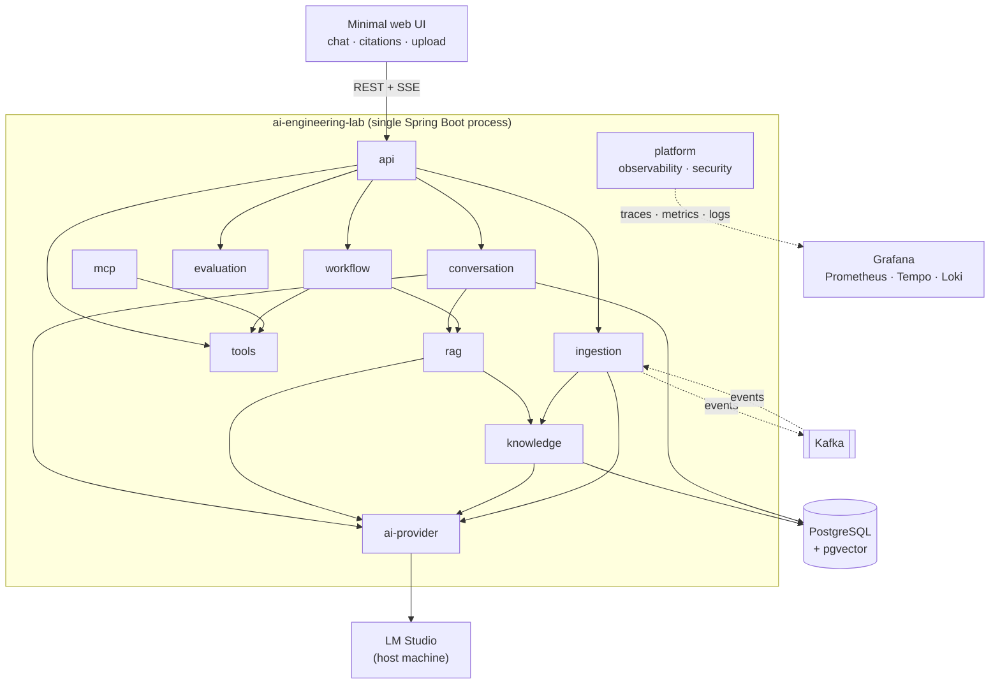

# AI Engineering Lab

A production-grade reference application for AI engineering on the JVM: hybrid RAG over pgvector,
event-driven ingestion on Kafka, controlled tool calling, MCP, agentic workflows, end-to-end
OpenTelemetry tracing, and an evaluation harness that produces numbers instead of adjectives.

Runs entirely on your own machine against a local model server. No API key required.

> **Status: design phase.** The architecture, module boundaries, contracts and roadmap are
> documented and reviewed. Implementation has not started. Every capability below is marked with
> its current state, and nothing is claimed to work until it does. See
> [`docs/roadmap.md`](docs/roadmap.md) for the phase plan.

---

## Why this exists

Most RAG demos answer one question well and collapse under the second. They have no story for what
happens when the embedding step fails, no way to tell whether a retrieval change made things better
or worse, and no answer to "what does this cost per request".

This project is built to have those answers. It treats an LLM application as a distributed system
with an unusually unreliable dependency, and it applies the practices that implies: explicit
failure handling, idempotent asynchronous processing, observable pipelines, measurable retrieval
quality, and a threat model that takes prompt injection seriously.

It is a portfolio piece, a laboratory for AI engineering techniques, and the reference material
behind a set of architecture conversations.

---

## Capabilities

| Capability | What it does | Status |
|---|---|---|
| Chat | Multi-turn conversations, SSE streaming, token and cost accounting | Planned — Phase 1 |
| Ingestion | Upload → parse → chunk → embed → index, asynchronously over Kafka, with retries and a dead-letter topic | Planned — Phase 2 |
| Hybrid retrieval | Vector kNN + PostgreSQL full-text, fused with Reciprocal Rank Fusion | Planned — Phase 3 |
| RAG with citations | Configurable pipeline, per-claim source attribution, unsupported-claim flagging | Planned — Phase 3 |
| Retrieval debugging | An endpoint that shows what was retrieved, with scores before and after reranking | Planned — Phase 3 |
| Evaluation | Golden dataset, recall@k, MRR, citation precision, latency, token cost, profile comparison | Planned — Phase 4 |
| Tool calling | Schema-validated registry with scoped authorization, timeouts and full tracing | Planned — Phase 5 |
| Agentic workflow | An explicit state machine with persisted state, resumable and compensable | Planned — Phase 6 |
| MCP | Tool registry exposed as an MCP server; external MCP servers consumed as clients | Planned — Phase 7 |

---

## Architecture at a glance

A **modular monolith** — one deployable process, hard internal boundaries verified at build time —
with genuinely asynchronous work pushed onto Kafka.



Why a modular monolith and not microservices: this system has one team, one deployment cadence and
no component with an independent scaling profile. Microservices would buy distribution costs
without buying anything back. Spring Modulith enforces the boundaries in tests, so if the ingestion
pipeline ever does need to scale separately, extracting it is mechanical rather than archaeological.
The full argument is in [ADR-0002](docs/adr/0002-modular-monolith.md).

Detailed views, sequence diagrams and the reasoning behind each boundary are in
[`docs/architecture.md`](docs/architecture.md).

---

## Technology

| Layer | Choice |
|---|---|
| Language | Java 25 (LTS) |
| Framework | Spring Boot 4.1 · Spring Framework 7 |
| AI integration | Spring AI 2.0, behind project-owned interfaces |
| Modularity | Spring Modulith (boundary verification + transactional event publication) |
| Build | Maven multi-module, wrapper committed |
| Persistence | PostgreSQL 17 + pgvector (HNSW), Flyway migrations |
| Messaging | Apache Kafka (KRaft) |
| Model server | LM Studio (OpenAI-compatible API), swappable for OpenAI/Anthropic |
| Embeddings | `bge-m3`, 1024 dimensions — fixed project-wide |
| Observability | OpenTelemetry → Collector → Prometheus, Tempo, Loki, Grafana |
| Testing | JUnit 5, Testcontainers, ArchUnit, WireMock, Toxiproxy |

Spring AI is an implementation detail behind `ChatProvider` and `EmbeddingProvider`. Swapping model
providers is a configuration change, not a refactor — see
[ADR-0004](docs/adr/0004-ai-provider-abstraction.md).

---

## Getting started

> Available from Phase 0. The commands below describe the intended experience and are the
> acceptance criteria for that phase.

**Prerequisites**

- Java 25 (or just Docker — the build runs in a container too)
- Docker with Compose
- [LM Studio](https://lmstudio.ai/) running on the host, with two models loaded:

| Role | Minimum tier | Recommended tier |
|---|---|---|
| Chat | a 7–8B instruct model, quantized | a ~30B MoE (e.g. 30B-A3B class) |
| Embeddings | `bge-m3` | `bge-m3` |

The embedding model is **not** interchangeable: the database schema is dimensioned to 1024 and
changing models requires a full reindex. `scripts/bootstrap.sh` verifies the loaded model and its
dimensions before anything else runs, and fails with a clear message rather than a confusing
distance error three steps later.

**Run**

```bash
git clone https://github.com/Fragudev/ai-engineering-lab.git
cd ai-engineering-lab

./scripts/bootstrap.sh      # checks LM Studio, models and embedding dimensions
docker compose -f infrastructure/docker-compose.yml up -d
./mvnw verify
./scripts/seed.sh           # ingests the demo corpus so the first question has an answer
```

Then open <http://localhost:8080>. Grafana is on `:3000`, Kafka UI on `:8081`.

Prefer not to install LM Studio? The `recorded` provider profile replays captured fixtures, so the
application is fully explorable without a model server. It is also what CI uses — see
[Testing strategy](docs/architecture.md#11-testing-strategy).

---

## Repository layout

```text
app/                  the single deployable Spring Boot application
modules/              domain modules with enforced boundaries
  shared/               ids, domain errors, event envelope
  ai-provider/          LLM and embedding abstraction + adapters
  conversation/         chat, history, streaming
  ingestion/            document lifecycle, Kafka consumers
  knowledge/            chunks, vector + lexical search, reranking
  rag/                  pipeline orchestration, context building, citations
  tools/                registry, schemas, authorization, execution
  workflow/             agentic workflow state machine
  mcp/                  MCP server and client
  evaluation/           datasets, runners, metrics
  platform/             observability, security, resilience, idempotency
docs/                 architecture, ADRs, threat model, evaluation methodology
infrastructure/       docker-compose, Grafana dashboards, OTel config
corpus/               demo documents and license attribution
eval/                 golden dataset and generated reports
scripts/              bootstrap, seed, reindex, eval, demo
```

---

## Documentation

| Document | What it answers |
|---|---|
| [Architecture](docs/architecture.md) | Structure, boundaries, contracts, data model, sequence diagrams |
| [Roadmap](docs/roadmap.md) | Phases, acceptance criteria, what is deliberately deferred |
| [ADRs](docs/adr/) | Why each significant decision was made, and what it cost |
| [Threat model](docs/threat-model.md) | STRIDE + OWASP LLM Top 10, mitigations, accepted risk |
| [Evaluation](docs/ai-evaluation.md) | Metrics, methodology, and where the methodology is weak |
| [Operations](docs/operations.md) | Runbook, what to look at when something breaks |
| [Events](docs/events/) | Topic contracts and JSON Schemas |
| [AGENTS.md](AGENTS.md) | Conventions and constraints for contributors, human or agent |

---

## Evaluation

Retrieval quality is a measured property, not a claim. The harness runs a golden dataset against
named RAG profiles and produces a comparison table: recall@k, MRR, citation precision, p50/p95
latency and token cost per configuration.

Reports are committed to `eval/reports/` with the date, chat model and hardware recorded, because a
retrieval number without the model and machine behind it is not reproducible.

Two things this project will **not** do: publish performance figures that were not measured, and
present LLM-as-judge scores as primary evidence. Judge scores are reported as a secondary,
explicitly caveated signal — a local model grading another local model is a weak instrument, and
[`docs/ai-evaluation.md`](docs/ai-evaluation.md) says so plainly.

---

## Non-goals and known limitations

Stated up front, because a portfolio project that hides its edges is less convincing than one that
maps them.

- **No multi-tenancy.** Single user, simple authentication. Row-level isolation and per-tenant
  index partitioning are designed in `docs/architecture.md` but not built.
- **No Kubernetes, no cloud deployment.** Local Docker Compose only. The README's deployment
  section describes how it would map to a managed environment; it is analysis, not infrastructure.
- **No schema registry.** Event schemas are versioned JSON Schema files. With one producer, Avro
  plus a registry container is cost without benefit — see [ADR-0005](docs/adr/0005-kafka.md).
- **No trained reranker.** Reranking uses an off-the-shelf model or the LLM itself.
- **No semantic cache** before Phase 8.
- **Deliberately minimal UI.** Enough to demonstrate streaming, citations and ingestion progress.
  It is not the point of the project.
- **Local models are weaker than frontier models**, particularly at tool calling. The provider
  abstraction exposes model capabilities so the system degrades explicitly rather than mysteriously.

---

## License

[Apache License 2.0](LICENSE). The demo corpus is third-party content under its own permissive
licenses, listed in [`corpus/ATTRIBUTION.md`](corpus/ATTRIBUTION.md).
