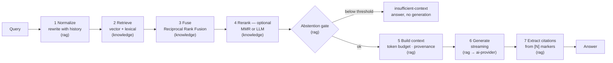
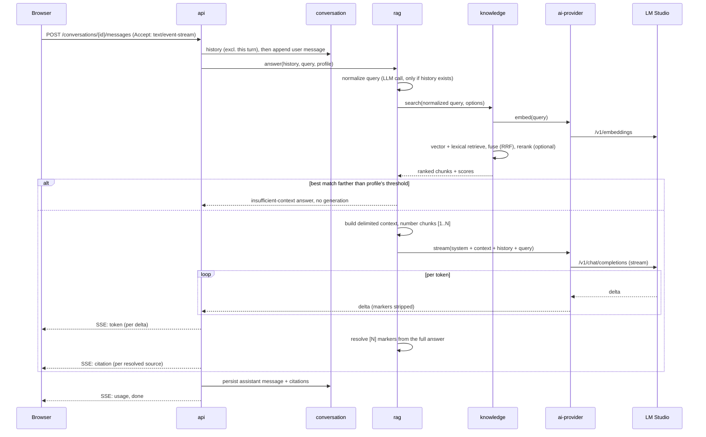
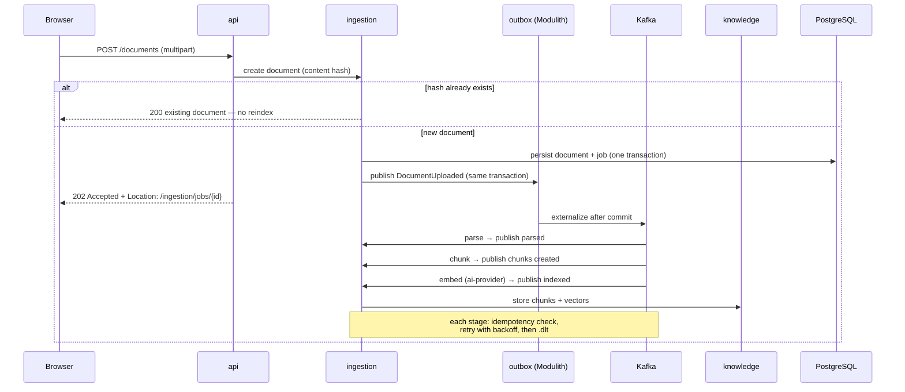
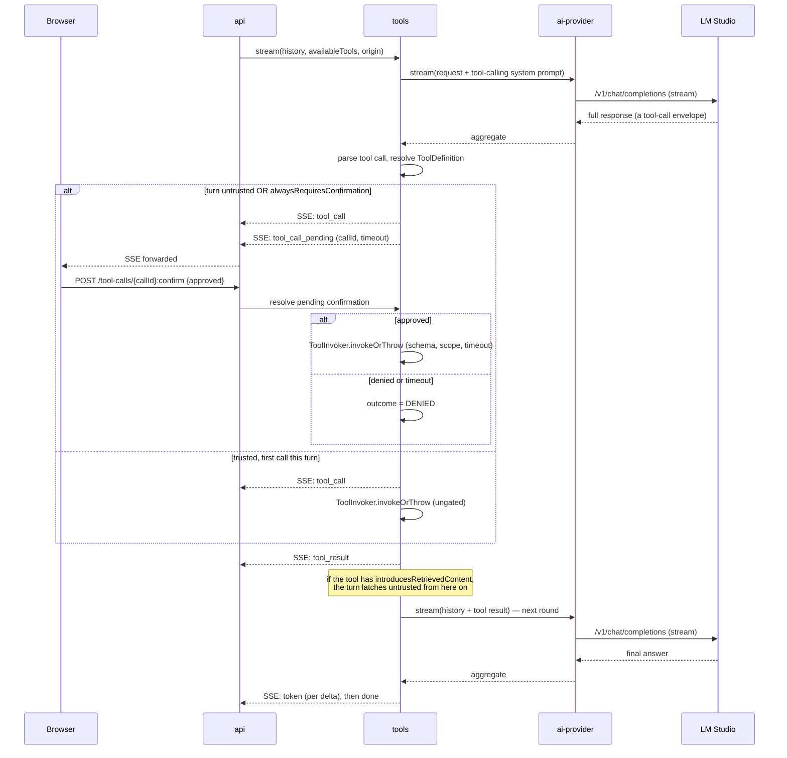

# Architecture

How the system is built and, more importantly, why. Individual decisions have their own records in
[`adr/`](adr/); this document is the connective tissue between them.

**Status:** All 8 implementation phases (`docs/roadmap.md`) are complete. This document describes the
system as built, not a design intent — sections note which phase built each piece, and any remaining
gap between what's described and what's real is named explicitly rather than left implicit.

---

## 1. Context

A single-user platform for asking questions over an ingested knowledge base, backed by a local
model server. Users upload documents, ask questions, receive cited answers, invoke controlled tools,
run multi-step workflows, inspect execution traces, and evaluate answer quality against a dataset.

**Quality attributes, in priority order.** When two conflict, the higher one wins:

1. **Observability** — every answer must be explainable after the fact: what was retrieved, why,
   at what cost.
2. **Explicit failure handling** — no silently swallowed errors, no partially indexed documents in
   an unknown state.
3. **Measurability** — retrieval and answer quality are numbers produced by a harness.
4. **Maintainability** — boundaries enforced by tooling, not by convention and hope.
5. **Latency** — matters for chat, secondary for ingestion.
6. **Scalability** — designed for, not built for. Single-node is the target.

Deliberately absent: availability targets and horizontal scale. A local single-node system that
claimed an SLA would be theatre.

---

## 2. Architectural style

A **modular monolith**: one deployable Spring Boot process containing modules with enforced
boundaries, with long-running work handled asynchronously over Kafka.

### Why not microservices

The usual reasons to distribute are independent deployment cadence, independent scaling, team
autonomy and fault isolation. This system has one contributor, one release cadence, and no component
whose load profile diverges enough to justify separate scaling. Splitting it would buy network
partitions, distributed transactions and eleven Docker containers, and buy back nothing.

The interesting engineering claim is not "I can build microservices" — it is "I can identify
boundaries correctly and know when distribution pays". Spring Modulith makes that claim testable:
boundaries are verified in the build, so if ingestion ever does need to scale independently, the
module is already isolated and extraction is mechanical.

Full reasoning: [ADR-0002](adr/0002-modular-monolith.md).

### Why Kafka from day one

Kafka is not here for decoration. Document ingestion is genuinely long-running and multi-stage, and
each stage fails differently: parsing fails on corrupt files, embedding fails on a model server
timeout, indexing fails on a database constraint. Decoupling the stages gives per-stage retry
policies, a dead-letter topic that makes failure visible instead of silent, and back-pressure when
the embedding model is the bottleneck.

The cost is real and accepted: contracts must be versioned from the first commit, and consumers must
be idempotent because at-least-once delivery is the only honest guarantee. Both are documented
below. [ADR-0005](adr/0005-kafka.md).

### Synchronous or asynchronous

| Flow | Mode | Reason |
|---|---|---|
| Chat and RAG query | Synchronous, SSE streaming | A human is waiting; perceived latency dominates |
| Document upload | Asynchronous, `202` + job resource | Parsing and embedding take seconds to minutes |
| Tool invocation | Synchronous, hard timeout | Happens inside a model turn |
| Agentic workflow | Asynchronous, persisted state | Runs for minutes; must survive a restart |
| Evaluation run | Asynchronous | Long batch |

---

## 3. Modules

Each module exposes an API in its root package and hides implementation under `internal`. Spring
Modulith and ArchUnit fail the build on a violation.

| Module | Responsibility | Depends on |
|---|---|---|
| `shared` | Typed ids, domain errors, event envelope | — |
| `ai-provider` | `ChatProvider`, `EmbeddingProvider`, token/cost accounting, resilience | `shared` |
| `conversation` | Conversations, messages, streaming, context window management | `shared`, `ai-provider`, `tools` |
| `ingestion` | Document lifecycle, jobs, Kafka producers and consumers | `shared`, `ai-provider`, `knowledge` |
| `knowledge` | Chunks, embeddings, hybrid search, reranking | `shared`, `ai-provider` |
| `rag` | Configurable pipeline, context building, citation extraction | `shared`, `ai-provider`, `knowledge`, `tools` |
| `tools` | Registry, schemas, authorization, sandboxed execution, tool-calling orchestration | `shared`, `ai-provider` |
| `workflow` | State machine, run persistence, compensation | `shared`, `ai-provider`, `knowledge`, `rag`, `tools` |
| `mcp` | MCP server exposing tools; MCP client for external servers | `shared`, `tools` |
| `evaluation` | Datasets, run execution, metrics, reports | `shared`, `rag`, `conversation`, `knowledge`, `ingestion` |
| `platform` | OpenTelemetry, security, rate limiting, idempotency, Problem Details | `shared` |

**Invariants:**

- No domain module depends on `app`. `app` wires everything and owns no domain logic.
- No module imports another module's `internal` package.
- Cross-module communication is a public API call or a domain event. Nothing else.
- `platform` is depended upon, never depends on a domain module.

Dependency direction is acyclic by construction. `evaluation` depending on `rag` and `conversation`
is intentional: evaluation is a consumer of the system, not a peer of it. `knowledge` and `ingestion`
were added to this list during Phase 4 implementation, not originally planned here: resolving a
golden-dataset case's `gold_chunk_refs` (`"title#ordinal"`, stable across a fresh corpus fetch,
unlike a chunk's random `UUID` primary key) against real ingested content is evaluation's own
concern, requiring it to query `ingestion.Document` (by title) and `knowledge.Chunk` (by ordinal)
directly — the same kind of documented boundary correction Phase 3 made for `knowledge`/`rag`.
`tools → ai-provider` and `conversation`/`rag → tools` were added during Phase 5 implementation for
the same reason: two already-accepted documents (ADR-0004, §8 below) had already assumed `tools`
depends on `ProviderCapabilities` for its structured-output fallback, a real contradiction with this
table that ADR-0009 resolves rather than papers over; `conversation` and `rag` both need to invoke
`tools.ToolCallingChatService` from their respective chat paths. `workflow → knowledge` was added
during Phase 6 implementation for the same category of reason: `rag.RagPipeline.search`'s own return
type carries `knowledge.SearchResult`/`Chunk` directly, and the `retrieve` stage genuinely reads
them — see docs/adr/0010-agent-orchestration.md.

---

## 4. Domain model

**Conversation**

- `Conversation` — id, title, active RAG profile, timestamps
- `Message` — role (`user` / `assistant` / `tool` / `system`), content, model, token counts, latency
- `Citation` — message → chunk, relevance score, quoted span

**Knowledge**

- `Document` — source, title, MIME type, content hash, status, metadata
- `Chunk` — parent document, ordinal, text, embedding, token count, inherited metadata
- `IngestionJob` — document, stage, attempt count, last error, timestamps

The content hash is load-bearing: it gives upload deduplication and ingestion idempotency for free.
Uploading the same file twice does not reindex it, and a redelivered Kafka message does not create a
second copy.

**Tools**

- `ToolDefinition` — name, version, input/output JSON Schema, required scopes, whether the tool
  introduces retrieved (untrusted) content into the conversation (Phase 5, ADR-0009), whether it
  always requires confirmation regardless of turn history — `true` only for tools sourced from an
  external MCP server (Phase 7, ADR-0011, docs/threat-model.md T9)
- `ToolInvocation` — tool, arguments, result, duration, outcome (`ok` / `timeout` / `denied` / `error`)

**Workflow**

- `WorkflowRun` — type (`documentation-research`), status (`PENDING` / `RUNNING` / `SUCCEEDED` /
  `FAILED` — no separate compensating state; every stage is read-only/computational, so compensating
  a failed run *is* the transition into `FAILED`, see docs/adr/0010-agent-orchestration.md), input,
  output, correlation id
- `WorkflowStep` — run, step index, step name (`plan-sub-queries` / `retrieve` /
  `extract-per-source` / `synthesise` / `self-check` / `answer`), status (`PENDING` / `RUNNING` /
  `SUCCEEDED` / `FAILED`), input, output, attempts, cost. One row per stage, not per sub-task inside
  a fan-out stage (e.g. `retrieve`'s per-sub-query results live inside that one row's output JSON).

**Evaluation**

- `EvalDataset` / `EvalCase` — question, expected answer, gold chunk refs (`"title#ordinal"`,
  resolved to real chunk ids at run time — see §3), tags, category
- `EvalRun` / `EvalResult` — case, RAG profile used, model, metrics, produced answer

---

## 5. API contracts

API-first: the OpenAPI 3.1 specification is written before the controller, and CI validates the
implementation against it. Errors use **Problem Details (RFC 9457)**. `Idempotency-Key` is honoured
on every resource-creating `POST`.

```
POST   /api/v1/conversations
GET    /api/v1/conversations/{id}
POST   /api/v1/conversations/{id}/messages      # SSE when Accept: text/event-stream
GET    /api/v1/conversations/{id}/messages

POST   /api/v1/documents                        # multipart → 202 + Location: job
GET    /api/v1/documents
GET    /api/v1/documents/{id}
DELETE /api/v1/documents/{id}                   # removes chunks and index entries
GET    /api/v1/ingestion/jobs/{id}

POST   /api/v1/retrieval:search                 # debug view into the retrieval pipeline
GET    /api/v1/rag/profiles

GET    /api/v1/tools
POST   /api/v1/tools/{name}:invoke
POST   /api/v1/tool-calls/{callId}:confirm      # resolves a pending confirmation, docs/threat-model.md T2

POST   /api/v1/workflows/{type}/runs            # 202 + Location: run
GET    /api/v1/workflows/runs/{id}
```

`POST /api/v1/tool-calls/{callId}:confirm` wasn't planned here originally — added during Phase 5
implementation once T2's confirmation control (already named in the threat model) was actually
designed down to an endpoint. See ADR-0009.

`GET /api/v1/workflows/runs/{id}` nests every stage's input, output, attempts and cost inline in the
run's own response — no separate steps endpoint exists or is planned; nothing in Phase 6's
acceptance criteria needs one. A run resumes automatically on application startup if it was left
`PENDING` or `RUNNING` by an interrupted process — see ADR-0010.

The MCP server (Phase 7) is **not** a path in this list — it's JSON-RPC 2.0 over Streamable HTTP,
mounted by Spring AI's own autoconfiguration at its own path (`/mcp` by default), not a Spring MVC
`@RestController` resource. It re-exposes the exact same tool registry `GET /api/v1/tools` and
`POST /api/v1/tools/{name}:invoke` already do, through MCP's own protocol instead of plain REST. See
ADR-0011.

Evaluation runs are **not** exposed over this API. A REST pair (`POST /api/v1/evaluations/runs`,
`GET .../{id}`) was the original plan here, but Phase 4 implementation chose a CLI instead: an eval
run is a long-running batch job with no caller waiting synchronously on the other end (a developer or
CI, not an end user), and the roadmap's own acceptance criteria only ever require `./scripts/eval.sh`
to work — a REST endpoint would have added surface area no requirement asked for. `EvalCliRunner`
(`app`, `@Profile("eval-cli")`) drives `evaluation.EvalRunner` reusing the full real Spring context
(real Postgres, real `RagPipeline`) and exits via `SpringApplication.exit(...)`; `scripts/eval.sh`
wraps it.

`POST /api/v1/retrieval:search` deserves emphasis. It returns the rewritten query, the candidate set
from each retriever, scores before and after fusion and reranking, and the chunks that survived into
the context. It is the difference between having built a RAG pipeline and being able to explain what
it did.

**Chat SSE event types:** `token`, `citation`, `tool_call`, `tool_call_pending`, `tool_result`,
`usage`, `done`, `error`. `tool_call`/`tool_result` had no producer until Phase 5;
`tool_call_pending` is new in Phase 5, not part of this list's original scope — emitted only for a
tool call whose turn's context contains retrieved content (docs/threat-model.md T2), pausing the
stream until `POST /api/v1/tool-calls/{callId}:confirm` resolves it.

Streaming citations as discrete events rather than embedding markers in the token stream means the
client never has to parse the answer to render sources, and a truncated stream still leaves the
citations it already delivered intact.

---

## 6. Event contracts

Topics are versioned in their names. Every message carries a common envelope, modelled on
CloudEvents without adopting the full specification. Payload fields are inlined at the top level,
not nested under a `payload` key — a flat record serializes directly via Jackson with no custom
(de)serializer, and each topic's own schema in [`events/`](events/) is the full message shape:

```json
{
  "eventId": "0192f3a4-...",
  "type": "ingestion.document.uploaded.v1",
  "source": "ai-lab/ingestion",
  "subject": "document/0192f3a4-...",
  "time": "2026-08-18T10:00:00Z",
  "correlationId": "0192f3a4-...",
  "causationId": "0192f3a4-...",
  "documentId": "0192f3a4-..."
}
```

| Topic | Producer | Consumer |
|---|---|---|
| `ingestion.document.uploaded.v1` | api | ingestion · parser |
| `ingestion.document.parsed.v1` | ingestion · parser | ingestion · chunker |
| `ingestion.chunks.created.v1` | ingestion · chunker | ingestion · embedder |
| `ingestion.document.indexed.v1` | ingestion · embedder | job status, UI notification |
| `ingestion.document.failed.v1` | any stage | job status |
| `<topic>.dlt` | retry infrastructure | manual inspection |

### Reliability decisions

**Partition key is `documentId`.** Ordering is guaranteed per document, which is what matters, while
different documents process in parallel.

**Consumers are idempotent.** A `processed_event(consumer_group, event_id)` table with a composite
primary key makes redelivery a no-op. At-least-once delivery is assumed, never worked around.

**Retry then dead-letter.** Spring Kafka's `DefaultErrorHandler` with exponential backoff and jitter,
then the topic's `.dlt`. Non-retryable failures — unsupported MIME type, corrupt file, schema
violation — skip the retries and go straight to the DLT. Retrying a permanently broken document
three times only delays the inevitable and pollutes the metrics.

**Correlation propagates end to end.** Every event carries the upload's `correlationId`, and every
consuming stage tags its active span with it (`io.micrometer.tracing.Tracer`). This is deliberately
not the same claim as "one unbroken W3C trace": Spring Modulith externalizes events to Kafka
asynchronously after transaction commit, so the HTTP request and the Kafka-publish chain land as
separate trace IDs in Tempo — the whole flow from `POST /documents` to the last chunk indexed is
fully recoverable by filtering Tempo on `correlationId`, verified live, which is the guarantee this
system actually makes.

**Entering Kafka: the transactional outbox.** Writing to the database and publishing to Kafka are
not atomic, and the naive version loses events on crash. Spring Modulith's event publication registry
persists the domain event in the same transaction as the state change and externalises it after
commit, retrying incomplete publications on startup. This is the outbox pattern without a
hand-written outbox table. [ADR-0005](adr/0005-kafka.md).

**Serialization is versioned JSON Schema, not Avro.** Schemas live in [`events/`](events/). With one
producer and one consumer group per topic, a Schema Registry container adds operational weight
without solving a problem this system has. Adding a required field means a new topic version.

---

## 7. Data model

PostgreSQL 17 with pgvector. Flyway migrations, forward-only.

```
conversation(id, title, rag_profile, created_at, updated_at)
message(id, conversation_id, role, content, model,
        prompt_tokens, completion_tokens, latency_ms, estimated_cost_usd, created_at)
citation(id, message_id, chunk_id, document_id, score, quoted_span, ordinal, created_at)

document(id, source_uri, title, mime_type, content_hash UNIQUE,
         status, metadata JSONB, created_at)
chunk(id, document_id, ordinal, content, token_count, metadata JSONB,
      embedding vector(1024), content_tsv tsvector GENERATED)
ingestion_job(id, document_id, stage, attempts, last_error, created_at, updated_at)

tool_invocation(id, message_id, tool_name, arguments JSONB, result JSONB,
                outcome, duration_ms, created_at)

workflow_run(id, type, status, input JSONB, output JSONB, correlation_id, ...)
workflow_step(id, run_id, name, status, input JSONB, output JSONB, attempts, ...)

eval_dataset(id, name, version)
eval_case(id, dataset_id, question, expected_answer, gold_chunk_ids, tags)
eval_run(id, dataset_id, rag_profile, model, hardware, started_at, finished_at)
eval_result(id, run_id, case_id, answer, metrics JSONB)

processed_event(consumer_group, event_id, processed_at)   -- composite PK
idempotency_key(key, endpoint, response_hash, created_at)

event_publication(id, listener_id, event_type, serialized_event, publication_date,
                   completion_date, last_resubmission_date, completion_attempts, status)
```

`event_publication` is Spring Modulith's transactional-outbox bookkeeping table (the mechanism behind
"entering Kafka" above), not application domain data — it doesn't auto-provision itself under this
project's Flyway-only, `ddl-auto=none` setup, so it's a real Flyway migration (V4) like everything
else, with `serialized_event` as `TEXT` (Hibernate's own default of `VARCHAR(255)` is too small for a
base64-encoded file payload).

**Indexes.** HNSW on `chunk.embedding` — better recall-per-latency than IVFFlat and, unlike IVFFlat,
it needs no representative training set, which matters when the index starts empty. GIN on
`chunk.content_tsv` for lexical search, GIN on metadata JSONB for filtered retrieval.

**`citation` is denormalized, not joined against `chunk`/`document` at read time.** `conversation`
doesn't depend on `knowledge` (§3), so `score` and `quoted_span` are copied in by `rag` at generation
time rather than looked up later — `chunk_id`/`document_id` are still real FKs at the database level,
the module boundary is a Java/ArchUnit concern, not a schema one (same precedent as `chunk.document_id`
referencing `document`, a different module, since Phase 2).

**Embedding dimension is fixed at 1024** (`bge-m3`) across every environment. It is a schema-level
commitment: changing the embedding model invalidates every stored vector and requires a full
reindex. A `scripts/reindex.sh` command exists for exactly that, and bootstrap verifies the loaded
model's dimensions before the application will start. [ADR-0003](adr/0003-persistence-and-vector-store.md).

**Hybrid search.** Vector kNN and PostgreSQL full-text run in parallel and are fused with Reciprocal
Rank Fusion. Pure dense retrieval is weak precisely where technical documentation needs it most:
exact class names, configuration keys, error codes. RRF needs no tuned weights and no extra
infrastructure. Whether it actually helps is an empirical question, and the evaluation harness
answers it with a number rather than an assertion.

---

## 8. AI provider abstraction

The goal is avoiding systemic lock-in, not building a perfect universal interface. Thin
project-owned interfaces live in `ai-provider`; Spring AI is an implementation detail inside the
adapters, never a type that leaks across the codebase.

```java
public interface ChatProvider {
    ChatResponse complete(ChatRequest request);
    Flux<ChatChunk> stream(ChatRequest request);
    ProviderCapabilities capabilities();
}

public interface EmbeddingProvider {
    List<Embedding> embed(List<String> texts);
    int dimensions();
    String modelId();
}
```

| Adapter | Purpose |
|---|---|
| `lmstudio` | Default. OpenAI-compatible API at `http://host.docker.internal:1234/v1` |
| `openai` / `anthropic` | Alternative profiles, API key required |
| `recorded` | Replays captured fixtures. **This is what CI uses.** |
| `deterministic` | Hash-based embeddings and fixed responses, for unit tests with no I/O |

Cross-cutting for all adapters: timeout, retry with jitter, circuit breaker (Resilience4j), token and
estimated-cost accounting, and one OpenTelemetry span per call carrying model, token counts and
latency as attributes.

`ProviderCapabilities` is what keeps the abstraction honest. It reports whether the current model
supports native tool calling, structured output, and what its context limit is. The `tools` module
queries it and falls back to constrained structured output with schema-validated parsing when native
tool calling is unavailable or unreliable — which, with small local models, it frequently is. Without
that, the abstraction would leak the moment the model changed. [ADR-0004](adr/0004-ai-provider-abstraction.md).
Built in Phase 5 as `tools.ToolCallingChatService`; both real adapters (`lmstudio`, `recorded`)
report `supportsNativeToolCalling() == false` today, so this always exercises the fallback path in
practice — see [ADR-0009](adr/0009-tool-design-and-security-boundaries.md).

---

## 9. RAG pipeline

Split across two modules per §3: `knowledge` owns retrieval and reranking (it's the one that knows
how to rank chunks), `rag` owns everything around generating a grounded, cited answer from what
`knowledge` found. Each stage emits its own OpenTelemetry span.



The abstention gate — ADR-0008 — checks raw vector distance, not the fused score: RRF scores reflect
rank position, not absolute relevance, so they can't distinguish "nothing relevant exists" from
"here's the best of what's there." A metadata/threshold/dedupe filter stage was planned between
retrieve and rerank but folded into fusion + the abstention gate once that distinction became clear
during implementation — see ADR-0007's "alternatives considered".

### Profiles make quality measurable

A `RagProfile` is a named configuration — top-k, fusion weights, reranker on or off, chunking
strategy, context token budget — selectable per conversation and overridable per request.

This is the mechanism that turns "make retrieval quality measurable" from an aspiration into a
table. The evaluation harness runs the same golden dataset against multiple profiles and reports the
difference. Without named, swappable configurations, every retrieval change is an opinion.

### Hallucination mitigation

Retrieved content is wrapped in explicit provenance delimiters. The system prompt instructs the model
to cite by chunk identifier and to state plainly when the context is insufficient rather than
filling the gap. The citation extractor maps claims to chunks and flags the ones with no support.

This reduces hallucination. It does not eliminate it, and the README says so. A system that claimed
otherwise would be making exactly the kind of unfalsifiable assertion this project exists to avoid.

### Indirect prompt injection

Retrieved content is untrusted input. A malicious document in the knowledge base is an attack vector
against every future query. Retrieved text is delimited, never concatenated into the instruction
region, and never permitted to trigger a tool invocation on its own authority. Details in
[`threat-model.md`](threat-model.md).

---

## 10. Key flows

### Chat with RAG

`app` is the composition root: `conversation` and `rag` never call each other directly (§3's
dependency table doesn't list that edge either way) — `app` fetches history and appends the user
turn via `conversation`, drives the answer via `rag`, then persists the reply + citations back
through `conversation` once the stream completes (ADR-0008).



### Asynchronous ingestion



### Tool calling with confirmation

The pause/approve/resume gate (docs/threat-model.md T2, [ADR-0009](adr/0009-tool-design-and-security-boundaries.md)) —
built Phase 5, not obvious from reading `tools.ToolCallingChatService` alone since the confirmation
wait spans two separate HTTP requests.



### MCP handshake and tool call

Discovery happens once at startup; every subsequent call is gated unconditionally
(docs/threat-model.md T9, [ADR-0011](adr/0011-mcp-tool-exposure-boundaries.md)) — built Phase 7, the
newest and least self-explanatory flow, since it spans a background registrar and the same
confirmation gate as the diagram above.

```mermaid
sequenceDiagram
    participant App as ApplicationReadyEvent
    participant R as mcp.McpClientToolRegistrar
    participant C as McpSyncClient
    participant S as External MCP server
    participant Reg as tools.ToolRegistry
    participant T as tools.ToolCallingChatService

    App->>R: fired once, application accepting connections
    R->>C: initialize()
    C->>S: JSON-RPC initialize
    S-->>C: InitializeResult (server name)
    R->>C: listTools()
    C->>S: JSON-RPC tools/list
    S-->>C: tool schemas
    R->>R: wrap each as McpClientTool,<br/>name := mcp:&lt;server&gt;:&lt;tool&gt;,<br/>alwaysRequiresConfirmation = true
    R->>Reg: register(tool) — for each

    Note over T: later, during a chat turn (see "Tool calling with confirmation")
    T->>T: definition.alwaysRequiresConfirmation() == true
    Note over T: gated on every call, regardless of<br/>turn origin or latching state
    T->>Reg: find("mcp:<server>:<tool>")
    T->>C: (via ToolInvoker → McpClientTool.execute) callTool(request)
    C->>S: JSON-RPC tools/call
    S-->>C: CallToolResult
    C-->>T: ToolResult
```

---

## 11. Testing strategy

**Every tool named below is a real, present dependency — verified by grepping every `pom.xml`, not
assumed (post-roadmap review issue #35).** An earlier version of this table named four tools that
were never added (OpenAPI validator, WireMock, Toxiproxy, Error Prone, NullAway) — a tooling
column that was fiction even where the underlying coverage was partly real by other means. Corrected
here rather than retrofitted by adopting four libraries purely to make a sentence true, matching the
Security row's own precedent (corrected the same way in Phase 8) and this project's own
"deliberately deferred, not silently dropped" discipline elsewhere.

| Level | Tooling | Coverage |
|---|---|---|
| Unit | JUnit 5, AssertJ | Domain logic, chunking, RRF fusion, token budgeting |
| Architecture | ArchUnit, Spring Modulith | Module boundaries, dependency rules, layering |
| Integration | Testcontainers (pgvector, Kafka) | Repositories, consumers, migrations |
| End-to-end | `DemoJourneyEndToEndTest`, tagged `e2e`, own CI job (post-roadmap review issue #34) | The exact journey `scripts/demo.sh` narrates by hand, chained in one flow: plain chat → real async ingestion → RAG answer with a citation → a confirmed tool call over a real MCP handshake → a persisted six-stage workflow run |
| Provider | A hand-written fake `ChatModel` (`LmStudioChatProviderTest`) — no WireMock, no live network call | A stalled stream times out as a typed `ProviderTimeoutException` rather than hanging. Narrower than once claimed: 429s, malformed JSON and invalid tool calls aren't exercised at this layer today |
| Failure path | Testcontainers (pgvector, Kafka) | Retry exhaustion → the dead-letter topic, with payload identity and a populated `last_error` asserted directly (`IngestionFailureIntegrationTest`, issue #32), plus a stalled provider timing out (Provider row, above). Database-down and Kafka-down scenarios are not exercised — no chaos/proxy tooling is wired in for it, named as a real gap rather than a Toxiproxy dependency that isn't there |
| AI evaluation | `evaluation` module + `scripts/eval.sh` (custom runner, not a tagged test suite) | Retrieval and answer quality |
| Static | Spotless | Formatting only — no Error Prone or NullAway is configured; correctness and nullability rely on `jspecify` annotations plus manual review, not a static-analysis gate |
| Security | OWASP Dependency-Check, Trivy, CodeQL, gitleaks — all real CI jobs since Phase 8 (`.github/workflows/ci.yml`, `codeql.yml`) | Dependencies, images, code, secrets |
| Coverage | JaCoCo, aggregated across the reactor via `app`'s `report-aggregate` (post-roadmap review issue #33) | 88.0% instruction coverage measured live 2026-08-24 (10,257/11,651 instructions; `app/target/site/jacoco-aggregate/`) |

**No automated API contract test.** `app/src/main/resources/openapi/openapi.yaml` is hand-maintained
and spec-first (written before the controller it describes, per this project's own working
convention) — nothing asserts the implementation still matches it once both have moved on. Removed
from the table above rather than left pointing at a MockMvc/OpenAPI-validator combination that was
never built; a real gap, not a tooling-name typo.

**Failure-path tests are the differentiating layer.** Everyone tests the happy path. Demonstrating
that a document whose embedding stage fails three times lands in the dead-letter topic with its job
in `FAILED`, a populated `last_error`, and a complete trace showing all three attempts — that is the
part worth reviewing. `IngestionFailureIntegrationTest` asserts all of it directly, including the
message actually landing on `ingestion.chunks.created.v1.dlt` (issue #32) — not merely that retries
were exhausted.

**The 88.0% coverage figure leans heavily on integration tests, not per-module unit tests** —
verified rather than assumed: `ingestion`, `shared`, `knowledge`, `rag`, `conversation` and `platform`
had zero test files of their own before the post-roadmap review (issues #30–#32 added real unit
coverage for the pure-function and previously-untested pieces, but most of these modules' remaining
coverage still comes from `app`'s own container-backed integration tests exercising them end to end).
That's a real number, not an invented one, but it measures "this code path executed during some
test," not "this code path has focused, fast, unit-level coverage" — the same distinction
docs/ai-evaluation.md draws between a metric passing and a metric meaning what it's assumed to mean.

**CI enforces a floor, but on a narrower bundle than the 88.0% headline figure — named plainly rather
than silently overclaimed.** `jacoco:check` (unlike `report-aggregate`) doesn't walk the reactor to
analyze sibling modules' bytecode; it only ever checks the current project's own compiled classes
against its own execution data. Bound in `app/pom.xml`, it therefore enforces a floor on `app`'s own
module specifically — measured live at 79.95% (1,619/2,025 instructions), well below the reactor
aggregate because most non-`app` modules' code is only exercised later, during `app`'s own integration
tests, which `app`'s own `jacoco.exec` never records. The threshold is set at 75%, a real margin below
that specific measurement — not the 88.0% aggregate, which would silently stay green even if `app`'s
own tests regressed badly as long as the rest of the reactor stayed covered.

**CI never calls a live model.** The `recorded` provider profile replays versioned fixtures, which
makes CI deterministic, free and offline. Real evaluation runs locally against LM Studio via
`scripts/eval.sh`, and its report is committed to `eval/reports/` with the date, chat model and
hardware recorded.

**No consumer-driven contract testing.** With a single producer and a single consumer group per
topic, Pact would add ceremony without catching a class of bug this system can have. JSON Schema
validation on both sides covers it. Recorded as a deliberate omission rather than an oversight.

---

## 12. Observability

See [ADR-0012](adr/0012-observability-conventions.md) for the naming conventions behind what follows,
and why this section names only what's real, not what was once intended.

**Traces.** OpenTelemetry SDK → Collector → Tempo. One trace per request, propagated through Kafka
headers to the end of ingestion. Two real spans carry attributes today: `ai-provider`'s `gen_ai.chat`
(`gen_ai.system`, `gen_ai.request.model`, `gen_ai.response.model`, `gen_ai.usage.input_tokens`,
`gen_ai.usage.output_tokens` — the current OTel GenAI semantic convention namespace, Phase 1) and
`rag`'s `rag.retrieve` (`rag.top_k`, `rag.rerank.enabled`, `rag.retrieved_chunk_count` — a
project-defined namespace for the retrieval stage, which GenAI semconv doesn't cover, Phase 8).

**Metrics.** Prometheus. Real today:

- `tool_invocation_total{tool, outcome}`, `tool_duration_seconds` (`tools.internal.ToolMetrics`, Phase 5)
- `workflow_run_total{type, status}`, `workflow_step_duration_seconds{stage, status}`
  (`workflow.internal.WorkflowMetrics`, Phase 6)
- `llm_degradation_total{component, reason}` (`aiprovider.LlmDegradationMetrics`, post-roadmap review
  issue #37) — every graceful fallback across the five call-the-model-and-degrade sites
  (`query-normalizer`, `llm-reranker`, `sub-query-planner`, `source-extractor`, `llm-judge`; issue #36's
  shared `DegradingChatCall` helper is where each one hooks in), `reason` one of `timeout`,
  `provider-unavailable`, `parse-failure`, or `provider-error` for anything else. Exists because a
  `WARN` log line was the only signal when `LlmReranker` fell back to fused order on every single call
  during Phase 8's live evaluation run — a complete, silent failure of a headline feature that would
  have shown up immediately as a flat line at 100% with this counter in place.

**Not yet built** — named plainly rather than left to look implemented: `rag_request_duration_seconds`,
`llm_tokens_total`, `llm_cost_usd_total`, `ingestion_job_duration_seconds`, `ingestion_jobs_active`,
`kafka_consumer_lag`, `dlt_messages_total`, `retrieval_score_distribution`. Building them without a
concrete consumer (a dashboard panel, an alert — neither exists today, see below) would be
speculative work this project's own `docs/roadmap.md` "Deliberately deferred" table already argues
against for comparable cases (see ADR-0012).

**Logs.** Structured JSON with `traceId` and `correlationId`, shipped to Loki. **Redaction is planned,
not built** (docs/threat-model.md T7) — this section previously claimed it was live, corrected in the
post-roadmap review rather than left (issue #24). What's true today, verified by a case-insensitive
grep for `redact`/`sanitiz`/`mask` across all 226 `src/main/java` files (one hit, an unrelated comment
in `platform.IdempotencyGuard`): no log statement or trace attribute anywhere in this codebase
includes prompt or completion content, so there is no active leak. But that's an absence, not a
guarantee — no redaction utility or lint exists to catch a future log line that does include content,
the way `LmStudioChatProvider`'s `gen_ai.*` trace attributes (model name, token counts) are
deliberately scoped to metadata today. The planned mitigation makes that an enforced invariant instead
of an accident of no one having added such a log line yet: prompt and completion content excluded
from logs and trace attributes by default, with a local-only flag to enable them for debugging and a
startup warning when it's on.

**Dashboards.** No dashboards are provisioned from the repository — this was previously stated here
and was never true; corrected in Phase 8's documentation review rather than left. Today, Grafana's
own Explore view (`grafana/otel-lgtm`'s default UI, no provisioning needed) is how traces, logs and
the two real metric families get inspected. The chat UI links each answer to Grafana's Explore view
with its `traceId` shown alongside, so a user can search for the exact trace — a small detail that
still changes a demo from "here is a chatbot" to "here is what it did," even without a
purpose-built dashboard. Provisioned dashboards (one for system health, one for AI cost and quality)
remain a real, named gap, not a silently dropped promise — building them well depends on the metrics
listed above as not-yet-built existing first.

The observability stack runs as a single `grafana/otel-lgtm` container rather than four separate
services, to keep the Compose file readable.

---

## 13. Security

Detail lives in [`threat-model.md`](threat-model.md). The structural points:

**Authentication.** Spring Security with a static API key in the local profile or a signed JWT.
Single user with roles. Everything authenticated except health endpoints and the UI shell.

**Tool authorization.** Each tool declares required scopes, checked *before* invocation. A model
requesting an unauthorized tool receives a structured denial it can explain to the user — not a
silent failure, and not an exception that surfaces as a generic error. Built in Phase 5
(`tools.internal.ScopeAuthorizer`) against a config-declared `ai.tools.granted-scopes` list, not yet
a real per-request principal — no Spring Security exists in this codebase yet, matching the
single-user, no-multi-tenancy stance; see [ADR-0009](adr/0009-tool-design-and-security-boundaries.md).

**Trust boundaries.** Four, and they are the ones that matter for an LLM system:

1. User input → the application. Standard validation.
2. **Retrieved document content → the prompt.** Untrusted. Delimited, never in the instruction
   region. A tool call the model makes after retrieved content entered its context is not blocked
   outright, but requires explicit user confirmation before it executes — the structural control
   for this boundary (docs/threat-model.md T2, ADR-0009), not a flat prohibition.
3. **Model output → tool execution.** Untrusted. Schema-validated, scope-checked, timeout-bounded.
4. **An external MCP server → this application (Phase 7).** Untrusted, in a different way from
   boundary 2: the risk isn't only what a tool *returns*, it's that the tool's own *implementation*
   is a remote process this application doesn't control. Every MCP-client-sourced tool requires
   explicit user confirmation on *every* call, not just once a turn is otherwise untrusted — stricter
   than boundary 2's rule, on purpose (docs/threat-model.md T9, ADR-0011).

Treating the model's output as untrusted input to the tool layer is the single most important
security posture in the system.

---

## 14. Local infrastructure

One `docker-compose.yml`, one command.

| Service | Image | Note |
|---|---|---|
| postgres | `pgvector/pgvector:pg17` | Flyway migrates on application startup |
| kafka | `apache/kafka` (KRaft) | No ZooKeeper |
| kafka-ui | `provectuslabs/kafka-ui` | Topic and DLT inspection during demos |
| observability | `grafana/otel-lgtm` | Collector, Prometheus, Tempo, Loki, Grafana |
| app | local build | `docker` profile |

LM Studio runs on the host and is reached at `host.docker.internal:1234`. `scripts/bootstrap.sh`
verifies it responds, that a chat model and an embedding model are loaded, and that the embedding
dimensions match the schema — failing loudly with a clear message if not. A reviewer who hits an
opaque error on first run never reaches the second screen.

`scripts/seed.sh` ingests the demo corpus, so the first experience is a system that already answers
with citations rather than an empty knowledge base.

---

## 15. Deployment: analysis, not implementation

There is no cloud deployment and no Kubernetes. Adding either would be infrastructure work that
demonstrates less than the analysis does. For the record, this is how it would map:

- **Application** — a container on ECS Fargate or Cloud Run. Stateless apart from SSE connections,
  which need session affinity or a shift to a resumable stream.
- **PostgreSQL** — RDS or Cloud SQL with the pgvector extension. At meaningful scale, a dedicated
  vector database becomes worth evaluating; the `knowledge` module's interface is the seam.
- **Kafka** — MSK or Confluent Cloud. The consumer group model and idempotency keys transfer
  unchanged.
- **Model serving** — a managed API, or vLLM on GPU instances if the local-model property must be
  preserved. The provider abstraction is the entire migration.
- **Observability** — the OTel Collector already exports OTLP; the backend becomes a configuration
  change.
- **Supply chain** — Phase 8's CI scanning (dependency, container, secret, CodeQL) and the CycloneDX
  SBOM published per release (`.github/workflows/release.yml`) already produce what a real deployment
  pipeline's admission-control gate would consume; nothing further is deployment-specific about them.
- **What would need real work** — secrets management, per-tenant isolation, cost controls with hard
  budget enforcement, and a retrieval-quality regression gate in the deployment pipeline.

---

## 16. Risks and accepted debt

| Risk | Impact | Mitigation |
|---|---|---|
| Local models too weak for reliable tool calling | High | `ProviderCapabilities` + structured-output fallback; `openai` profile for comparison; difference documented |
| LM Studio is a manual prerequisite, weakening clone-and-run | Medium | Bootstrap script with actionable errors; `recorded` profile needs no model server |
| Changing the embedding model forces a full reindex | Medium | Dimension fixed and verified at startup; no dedicated reindex script exists — today a reindex means clearing `chunk` and re-running `scripts/seed.sh`/re-uploading, a real gap, not a built tool; recorded in ADR-0003 |
| Kafka before the domain is stable | Medium | Versioned event contracts from the first commit; consumers behind interfaces |
| Scope exceeds available time | High | Phased delivery with clean stopping points; Phase 4 is the "presentable" line |
| LLM-as-judge with a local model is a weak instrument | Medium | Deterministic metrics are primary; limitation stated in the evaluation report |
| Documentation drifting from implementation | Medium | No automated doc-drift check exists — this project relies on documentation shipping with the change (`CONTRIBUTING.md`'s own rule) and an end-of-phase audit; Phase 8's own review found and corrected several places where this had already drifted (this table's previous two rows among them) |

**Accepted debt**, stated in the README because acknowledging it is worth more than hiding it: no
multi-tenancy, no row-level authorization, no Kubernetes, no schema registry, no trained reranker, no
semantic cache before Phase 8, deliberately minimal UI.
