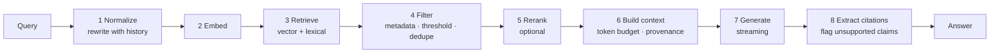
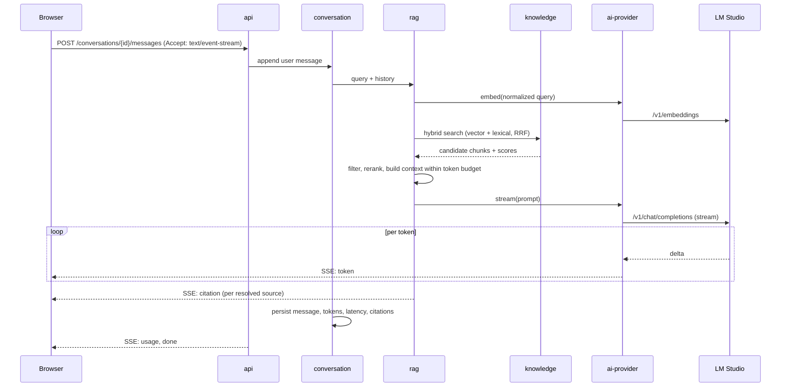
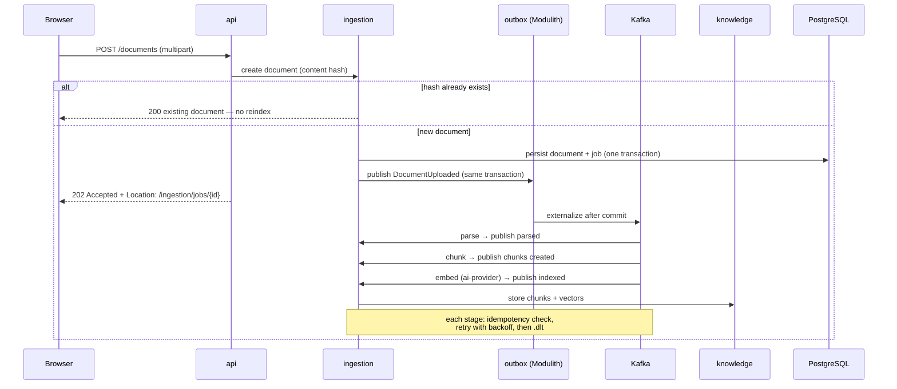

# Architecture

How the system is built and, more importantly, why. Individual decisions have their own records in
[`adr/`](adr/); this document is the connective tissue between them.

**Status:** design. No implementation yet. This document is the specification the implementation is
held to, not a description of existing code.

---

## 1. Context

A single-user platform for asking questions over an ingested knowledge base, backed by a local
model server. Users upload documents, ask questions, receive cited answers, invoke controlled tools,
run multi-step workflows, inspect execution traces, and evaluate answer quality against a dataset.

**Quality attributes, in priority order.** When two conflict, the higher one wins:

1. **Observability** — every answer must be explainable after the fact: what was retrieved, why,
   at what cost.
2. **Explicit failure handling** — no silently swallowed errors, no partially indexed documents in
   an unknown state.
3. **Measurability** — retrieval and answer quality are numbers produced by a harness.
4. **Maintainability** — boundaries enforced by tooling, not by convention and hope.
5. **Latency** — matters for chat, secondary for ingestion.
6. **Scalability** — designed for, not built for. Single-node is the target.

Deliberately absent: availability targets and horizontal scale. A local single-node system that
claimed an SLA would be theatre.

---

## 2. Architectural style

A **modular monolith**: one deployable Spring Boot process containing modules with enforced
boundaries, with long-running work handled asynchronously over Kafka.

### Why not microservices

The usual reasons to distribute are independent deployment cadence, independent scaling, team
autonomy and fault isolation. This system has one contributor, one release cadence, and no component
whose load profile diverges enough to justify separate scaling. Splitting it would buy network
partitions, distributed transactions and eleven Docker containers, and buy back nothing.

The interesting engineering claim is not "I can build microservices" — it is "I can identify
boundaries correctly and know when distribution pays". Spring Modulith makes that claim testable:
boundaries are verified in the build, so if ingestion ever does need to scale independently, the
module is already isolated and extraction is mechanical.

Full reasoning: [ADR-0002](adr/0002-modular-monolith.md).

### Why Kafka from day one

Kafka is not here for decoration. Document ingestion is genuinely long-running and multi-stage, and
each stage fails differently: parsing fails on corrupt files, embedding fails on a model server
timeout, indexing fails on a database constraint. Decoupling the stages gives per-stage retry
policies, a dead-letter topic that makes failure visible instead of silent, and back-pressure when
the embedding model is the bottleneck.

The cost is real and accepted: contracts must be versioned from the first commit, and consumers must
be idempotent because at-least-once delivery is the only honest guarantee. Both are documented
below. [ADR-0005](adr/0005-kafka.md).

### Synchronous or asynchronous

| Flow | Mode | Reason |
|---|---|---|
| Chat and RAG query | Synchronous, SSE streaming | A human is waiting; perceived latency dominates |
| Document upload | Asynchronous, `202` + job resource | Parsing and embedding take seconds to minutes |
| Tool invocation | Synchronous, hard timeout | Happens inside a model turn |
| Agentic workflow | Asynchronous, persisted state | Runs for minutes; must survive a restart |
| Evaluation run | Asynchronous | Long batch |

---

## 3. Modules

Each module exposes an API in its root package and hides implementation under `internal`. Spring
Modulith and ArchUnit fail the build on a violation.

| Module | Responsibility | Depends on |
|---|---|---|
| `shared` | Typed ids, domain errors, event envelope | — |
| `ai-provider` | `ChatProvider`, `EmbeddingProvider`, token/cost accounting, resilience | `shared` |
| `conversation` | Conversations, messages, streaming, context window management | `shared`, `ai-provider` |
| `ingestion` | Document lifecycle, jobs, Kafka producers and consumers | `shared`, `ai-provider`, `knowledge` |
| `knowledge` | Chunks, embeddings, hybrid search, reranking | `shared`, `ai-provider` |
| `rag` | Configurable pipeline, context building, citation extraction | `shared`, `ai-provider`, `knowledge` |
| `tools` | Registry, schemas, authorization, sandboxed execution | `shared` |
| `workflow` | State machine, run persistence, compensation | `shared`, `ai-provider`, `rag`, `tools` |
| `mcp` | MCP server exposing tools; MCP client for external servers | `shared`, `tools` |
| `evaluation` | Datasets, run execution, metrics, reports | `shared`, `rag`, `conversation` |
| `platform` | OpenTelemetry, security, rate limiting, idempotency, Problem Details | `shared` |

**Invariants:**

- No domain module depends on `app`. `app` wires everything and owns no domain logic.
- No module imports another module's `internal` package.
- Cross-module communication is a public API call or a domain event. Nothing else.
- `platform` is depended upon, never depends on a domain module.

Dependency direction is acyclic by construction. `evaluation` depending on `rag` and `conversation`
is intentional: evaluation is a consumer of the system, not a peer of it.

---

## 4. Domain model

**Conversation**

- `Conversation` — id, title, active RAG profile, timestamps
- `Message` — role (`user` / `assistant` / `tool` / `system`), content, model, token counts, latency
- `Citation` — message → chunk, relevance score, quoted span

**Knowledge**

- `Document` — source, title, MIME type, content hash, status, metadata
- `Chunk` — parent document, ordinal, text, embedding, token count, inherited metadata
- `IngestionJob` — document, stage, attempt count, last error, timestamps

The content hash is load-bearing: it gives upload deduplication and ingestion idempotency for free.
Uploading the same file twice does not reindex it, and a redelivered Kafka message does not create a
second copy.

**Tools**

- `ToolDefinition` — name, version, input/output JSON Schema, required scopes
- `ToolInvocation` — tool, arguments, result, duration, outcome (`ok` / `timeout` / `denied` / `error`)

**Workflow**

- `WorkflowRun` — type, status, input, output, correlation id
- `WorkflowStep` — run, step name, status, input, output, attempts, cost

**Evaluation**

- `EvalDataset` / `EvalCase` — question, expected answer, gold chunk ids, tags
- `EvalRun` / `EvalResult` — case, RAG profile used, model, metrics, produced answer

---

## 5. API contracts

API-first: the OpenAPI 3.1 specification is written before the controller, and CI validates the
implementation against it. Errors use **Problem Details (RFC 9457)**. `Idempotency-Key` is honoured
on every resource-creating `POST`.

```
POST   /api/v1/conversations
GET    /api/v1/conversations/{id}
POST   /api/v1/conversations/{id}/messages      # SSE when Accept: text/event-stream
GET    /api/v1/conversations/{id}/messages

POST   /api/v1/documents                        # multipart → 202 + Location: job
GET    /api/v1/documents
GET    /api/v1/documents/{id}
DELETE /api/v1/documents/{id}                   # removes chunks and index entries
GET    /api/v1/ingestion/jobs/{id}

POST   /api/v1/retrieval:search                 # debug view into the retrieval pipeline
GET    /api/v1/rag/profiles

GET    /api/v1/tools
POST   /api/v1/tools/{name}:invoke

POST   /api/v1/workflows/{type}/runs            # 202 + Location: run
GET    /api/v1/workflows/runs/{id}

POST   /api/v1/evaluations/runs                 # 202
GET    /api/v1/evaluations/runs/{id}
```

`POST /api/v1/retrieval:search` deserves emphasis. It returns the rewritten query, the candidate set
from each retriever, scores before and after fusion and reranking, and the chunks that survived into
the context. It is the difference between having built a RAG pipeline and being able to explain what
it did.

**Chat SSE event types:** `token`, `citation`, `tool_call`, `tool_result`, `usage`, `done`, `error`.

Streaming citations as discrete events rather than embedding markers in the token stream means the
client never has to parse the answer to render sources, and a truncated stream still leaves the
citations it already delivered intact.

---

## 6. Event contracts

Topics are versioned in their names. Every message carries a common envelope, modelled on
CloudEvents without adopting the full specification:

```json
{
  "eventId": "0192f3a4-...",
  "type": "ingestion.document.uploaded.v1",
  "source": "ai-lab/ingestion",
  "subject": "document/0192f3a4-...",
  "time": "2026-08-18T10:00:00Z",
  "correlationId": "0192f3a4-...",
  "causationId": "0192f3a4-...",
  "payload": {}
}
```

| Topic | Producer | Consumer |
|---|---|---|
| `ingestion.document.uploaded.v1` | api | ingestion · parser |
| `ingestion.document.parsed.v1` | ingestion · parser | ingestion · chunker |
| `ingestion.chunks.created.v1` | ingestion · chunker | ingestion · embedder |
| `ingestion.document.indexed.v1` | ingestion · embedder | job status, UI notification |
| `ingestion.document.failed.v1` | any stage | job status |
| `<topic>.dlt` | retry infrastructure | manual inspection |

### Reliability decisions

**Partition key is `documentId`.** Ordering is guaranteed per document, which is what matters, while
different documents process in parallel.

**Consumers are idempotent.** A `processed_event(consumer_group, event_id)` table with a composite
primary key makes redelivery a no-op. At-least-once delivery is assumed, never worked around.

**Retry then dead-letter.** Spring Kafka's `DefaultErrorHandler` with exponential backoff and jitter,
then the topic's `.dlt`. Non-retryable failures — unsupported MIME type, corrupt file, schema
violation — skip the retries and go straight to the DLT. Retrying a permanently broken document
three times only delays the inevitable and pollutes the metrics.

**Correlation propagates end to end.** The HTTP request's correlation id travels in Kafka headers
into every consumer and into the OpenTelemetry context, so a single upload is one connected trace in
Tempo from `POST /documents` to the last chunk indexed.

**Entering Kafka: the transactional outbox.** Writing to the database and publishing to Kafka are
not atomic, and the naive version loses events on crash. Spring Modulith's event publication registry
persists the domain event in the same transaction as the state change and externalises it after
commit, retrying incomplete publications on startup. This is the outbox pattern without a
hand-written outbox table. [ADR-0005](adr/0005-kafka.md).

**Serialization is versioned JSON Schema, not Avro.** Schemas live in [`events/`](events/). With one
producer and one consumer group per topic, a Schema Registry container adds operational weight
without solving a problem this system has. Adding a required field means a new topic version.

---

## 7. Data model

PostgreSQL 17 with pgvector. Flyway migrations, forward-only.

```
conversation(id, title, rag_profile, created_at, updated_at)
message(id, conversation_id, role, content, model,
        prompt_tokens, completion_tokens, latency_ms, created_at)
citation(id, message_id, chunk_id, score, quoted_span)

document(id, source_uri, title, mime_type, content_hash UNIQUE,
         status, metadata JSONB, created_at)
chunk(id, document_id, ordinal, content, token_count, metadata JSONB,
      embedding vector(1024), content_tsv tsvector GENERATED)
ingestion_job(id, document_id, stage, attempts, last_error, created_at, updated_at)

tool_invocation(id, message_id, tool_name, arguments JSONB, result JSONB,
                outcome, duration_ms, created_at)

workflow_run(id, type, status, input JSONB, output JSONB, correlation_id, ...)
workflow_step(id, run_id, name, status, input JSONB, output JSONB, attempts, ...)

eval_dataset(id, name, version)
eval_case(id, dataset_id, question, expected_answer, gold_chunk_ids, tags)
eval_run(id, dataset_id, rag_profile, model, hardware, started_at, finished_at)
eval_result(id, run_id, case_id, answer, metrics JSONB)

processed_event(consumer_group, event_id, processed_at)   -- composite PK
idempotency_key(key, endpoint, response_hash, created_at)
```

**Indexes.** HNSW on `chunk.embedding` — better recall-per-latency than IVFFlat and, unlike IVFFlat,
it needs no representative training set, which matters when the index starts empty. GIN on
`chunk.content_tsv` for lexical search, GIN on metadata JSONB for filtered retrieval.

**Embedding dimension is fixed at 1024** (`bge-m3`) across every environment. It is a schema-level
commitment: changing the embedding model invalidates every stored vector and requires a full
reindex. A `scripts/reindex.sh` command exists for exactly that, and bootstrap verifies the loaded
model's dimensions before the application will start. [ADR-0003](adr/0003-persistence-and-vector-store.md).

**Hybrid search.** Vector kNN and PostgreSQL full-text run in parallel and are fused with Reciprocal
Rank Fusion. Pure dense retrieval is weak precisely where technical documentation needs it most:
exact class names, configuration keys, error codes. RRF needs no tuned weights and no extra
infrastructure. Whether it actually helps is an empirical question, and the evaluation harness
answers it with a number rather than an assertion.

---

## 8. AI provider abstraction

The goal is avoiding systemic lock-in, not building a perfect universal interface. Thin
project-owned interfaces live in `ai-provider`; Spring AI is an implementation detail inside the
adapters, never a type that leaks across the codebase.

```java
public interface ChatProvider {
    ChatResponse complete(ChatRequest request);
    Flux<ChatChunk> stream(ChatRequest request);
    ProviderCapabilities capabilities();
}

public interface EmbeddingProvider {
    List<Embedding> embed(List<String> texts);
    int dimensions();
    String modelId();
}
```

| Adapter | Purpose |
|---|---|
| `lmstudio` | Default. OpenAI-compatible API at `http://host.docker.internal:1234/v1` |
| `openai` / `anthropic` | Alternative profiles, API key required |
| `recorded` | Replays captured fixtures. **This is what CI uses.** |
| `deterministic` | Hash-based embeddings and fixed responses, for unit tests with no I/O |

Cross-cutting for all adapters: timeout, retry with jitter, circuit breaker (Resilience4j), token and
estimated-cost accounting, and one OpenTelemetry span per call carrying model, token counts and
latency as attributes.

`ProviderCapabilities` is what keeps the abstraction honest. It reports whether the current model
supports native tool calling, structured output, and what its context limit is. The `tools` module
queries it and falls back to constrained structured output with schema-validated parsing when native
tool calling is unavailable or unreliable — which, with small local models, it frequently is. Without
that, the abstraction would leak the moment the model changed. [ADR-0004](adr/0004-ai-provider-abstraction.md).

---

## 9. RAG pipeline

Eight explicit stages. Each is a replaceable interface and each emits its own OpenTelemetry span.



### Profiles make quality measurable

A `RagProfile` is a named configuration — top-k, fusion weights, reranker on or off, chunking
strategy, context token budget — selectable per conversation and overridable per request.

This is the mechanism that turns "make retrieval quality measurable" from an aspiration into a
table. The evaluation harness runs the same golden dataset against multiple profiles and reports the
difference. Without named, swappable configurations, every retrieval change is an opinion.

### Hallucination mitigation

Retrieved content is wrapped in explicit provenance delimiters. The system prompt instructs the model
to cite by chunk identifier and to state plainly when the context is insufficient rather than
filling the gap. The citation extractor maps claims to chunks and flags the ones with no support.

This reduces hallucination. It does not eliminate it, and the README says so. A system that claimed
otherwise would be making exactly the kind of unfalsifiable assertion this project exists to avoid.

### Indirect prompt injection

Retrieved content is untrusted input. A malicious document in the knowledge base is an attack vector
against every future query. Retrieved text is delimited, never concatenated into the instruction
region, and never permitted to trigger a tool invocation on its own authority. Details in
[`threat-model.md`](threat-model.md).

---

## 10. Key flows

### Chat with RAG



### Asynchronous ingestion



---

## 11. Testing strategy

| Level | Tooling | Coverage |
|---|---|---|
| Unit | JUnit 5, AssertJ | Domain logic, chunking, RRF fusion, token budgeting |
| Architecture | ArchUnit, Spring Modulith | Module boundaries, dependency rules, layering |
| Integration | Testcontainers (pgvector, Kafka) | Repositories, consumers, migrations |
| API contract | OpenAPI validator, MockMvc | Implementation conforms to the published spec |
| Provider | WireMock + fixtures | Streaming, timeouts, 429s, malformed JSON, invalid tool calls |
| Failure path | Testcontainers + Toxiproxy | Database down, Kafka down, slow model, retry exhaustion → DLT |
| AI evaluation | Custom runner, `@Tag("ai-eval")` | Retrieval and answer quality |
| Static | Spotless, Error Prone, NullAway | Formatting, correctness, nullability |
| Security | OWASP Dependency-Check, Trivy, CodeQL, gitleaks | Dependencies, images, code, secrets |

**Failure-path tests are the differentiating layer.** Everyone tests the happy path. Demonstrating
that a document whose embedding stage fails three times lands in the dead-letter topic with its job
in `FAILED`, a populated `last_error`, and a complete trace showing all three attempts — that is the
part worth reviewing.

**CI never calls a live model.** The `recorded` provider profile replays versioned fixtures, which
makes CI deterministic, free and offline. Real evaluation runs locally against LM Studio via
`scripts/eval.sh`, and its report is committed to `eval/reports/` with the date, chat model and
hardware recorded.

**No consumer-driven contract testing.** With a single producer and a single consumer group per
topic, Pact would add ceremony without catching a class of bug this system can have. JSON Schema
validation on both sides covers it. Recorded as a deliberate omission rather than an oversight.

---

## 12. Observability

**Traces.** OpenTelemetry SDK → Collector → Tempo. One trace per request, propagated through Kafka
headers to the end of ingestion. Dedicated spans per RAG stage with attributes: `rag.top_k`,
`rag.retrieved_ids`, `rag.rerank.enabled`, `llm.model`, `llm.prompt_tokens`,
`llm.completion_tokens`, `llm.cost_usd`. OTel GenAI semantic conventions are followed where they
exist.

**Metrics.** Prometheus.

- `rag_request_duration_seconds` — histogram, labelled by stage
- `llm_tokens_total{direction, model}`, `llm_cost_usd_total`
- `ingestion_job_duration_seconds`, `ingestion_jobs_active`
- `kafka_consumer_lag`, `dlt_messages_total`
- `tool_invocation_total{tool, outcome}`, `tool_duration_seconds`
- `retrieval_score_distribution`

**Logs.** Structured JSON with `traceId` and `correlationId`, shipped to Loki. **Prompts and
completions are redacted by default**, with a local-only flag to enable them for debugging. Logging
full prompts by default would be a data leak in any real deployment; the flag and its warning are
deliberate.

**Dashboards** are provisioned from the repository, not clicked together by hand: one for system
health, one for AI cost and quality. The chat UI links each answer to its trace in Grafana — a small
detail that changes a demo from "here is a chatbot" to "here is what it did and what it cost".

The observability stack runs as a single `grafana/otel-lgtm` container rather than four separate
services, to keep the Compose file readable.

---

## 13. Security

Detail lives in [`threat-model.md`](threat-model.md). The structural points:

**Authentication.** Spring Security with a static API key in the local profile or a signed JWT.
Single user with roles. Everything authenticated except health endpoints and the UI shell.

**Tool authorization.** Each tool declares required scopes, checked against the principal *before*
invocation. A model requesting an unauthorized tool receives a structured denial it can explain to
the user — not a silent failure, and not an exception that surfaces as a generic error.

**Trust boundaries.** Three, and they are the ones that matter for an LLM system:

1. User input → the application. Standard validation.
2. **Retrieved document content → the prompt.** Untrusted. Delimited, never in the instruction
   region, never authorised to trigger tools.
3. **Model output → tool execution.** Untrusted. Schema-validated, scope-checked, timeout-bounded.

Treating the model's output as untrusted input to the tool layer is the single most important
security posture in the system.

---

## 14. Local infrastructure

One `docker-compose.yml`, one command.

| Service | Image | Note |
|---|---|---|
| postgres | `pgvector/pgvector:pg17` | Flyway migrates on application startup |
| kafka | `apache/kafka` (KRaft) | No ZooKeeper |
| kafka-ui | `provectuslabs/kafka-ui` | Topic and DLT inspection during demos |
| observability | `grafana/otel-lgtm` | Collector, Prometheus, Tempo, Loki, Grafana |
| app | local build | `docker` profile |

LM Studio runs on the host and is reached at `host.docker.internal:1234`. `scripts/bootstrap.sh`
verifies it responds, that a chat model and an embedding model are loaded, and that the embedding
dimensions match the schema — failing loudly with a clear message if not. A reviewer who hits an
opaque error on first run never reaches the second screen.

`scripts/seed.sh` ingests the demo corpus, so the first experience is a system that already answers
with citations rather than an empty knowledge base.

---

## 15. Deployment: analysis, not implementation

There is no cloud deployment and no Kubernetes. Adding either would be infrastructure work that
demonstrates less than the analysis does. For the record, this is how it would map:

- **Application** — a container on ECS Fargate or Cloud Run. Stateless apart from SSE connections,
  which need session affinity or a shift to a resumable stream.
- **PostgreSQL** — RDS or Cloud SQL with the pgvector extension. At meaningful scale, a dedicated
  vector database becomes worth evaluating; the `knowledge` module's interface is the seam.
- **Kafka** — MSK or Confluent Cloud. The consumer group model and idempotency keys transfer
  unchanged.
- **Model serving** — a managed API, or vLLM on GPU instances if the local-model property must be
  preserved. The provider abstraction is the entire migration.
- **Observability** — the OTel Collector already exports OTLP; the backend becomes a configuration
  change.
- **What would need real work** — secrets management, per-tenant isolation, cost controls with hard
  budget enforcement, and a retrieval-quality regression gate in the deployment pipeline.

---

## 16. Risks and accepted debt

| Risk | Impact | Mitigation |
|---|---|---|
| Local models too weak for reliable tool calling | High | `ProviderCapabilities` + structured-output fallback; `openai` profile for comparison; difference documented |
| LM Studio is a manual prerequisite, weakening clone-and-run | Medium | Bootstrap script with actionable errors; `recorded` profile needs no model server |
| Changing the embedding model forces a full reindex | Medium | Dimension fixed and verified at startup; `reindex.sh`; recorded in ADR-0003 |
| Kafka before the domain is stable | Medium | Versioned event contracts from the first commit; consumers behind interfaces |
| Scope exceeds available time | High | Phased delivery with clean stopping points; Phase 4 is the "presentable" line |
| LLM-as-judge with a local model is a weak instrument | Medium | Deterministic metrics are primary; limitation stated in the evaluation report |
| Documentation drifting from implementation | Medium | Modulith-generated module docs; documentation check in CI |

**Accepted debt**, stated in the README because acknowledging it is worth more than hiding it: no
multi-tenancy, no row-level authorization, no Kubernetes, no schema registry, no trained reranker, no
semantic cache before Phase 8, deliberately minimal UI.
